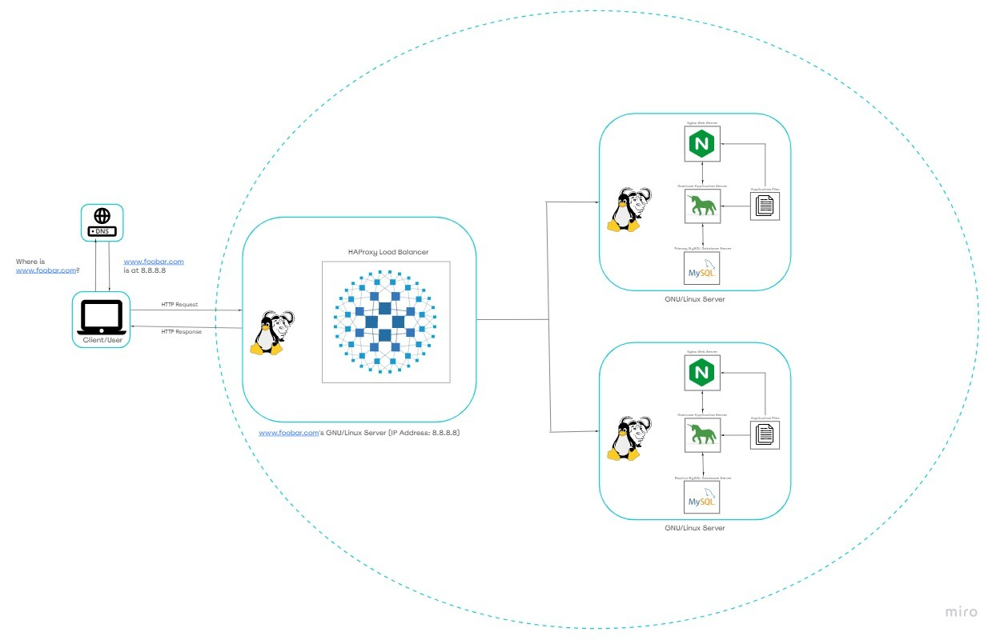

# Distributed Web Infrastructure

## Description

This system comprises a distributed web infrastructure aimed at alleviating traffic on the primary server by delegating some of the load to a replica server, facilitated by a load balancer tasked with evenly distributing the workload between the primary and replica servers.

## Details of the Infrastructure

Load Balancer Distribution Algorithm: Utilizing the HAProxy load balancer, the system employs the Round Robin distribution algorithm. This method cycles through servers behind the load balancer based on their assigned weights, ensuring a balanced distribution of processing time. It's an adaptable algorithm, allowing for dynamic adjustments to server weights.
Load-Balancer Enabled Setup: The HAProxy load balancer facilitates an Active-Passive setup rather than an Active-Active arrangement. In an Active-Active scenario, workloads are spread across all nodes to prevent overload on any single node, resulting in enhanced throughput and response times. Conversely, in an Active-Passive setup, not all nodes remain active at all times. For instance, in a two-node setup, if the first node is active, the second remains passive or on standby until needed.
Database Primary-Replica (Master-Slave) Cluster Operation: In this configuration, one server serves as the Primary and another as the Replica. The Primary server handles read/write requests, while the Replica server only manages read requests. Data synchronization occurs whenever a write operation is executed on the Primary server.
Application Node Distinction: The Primary node manages all write operations for the site, whereas the Replica node handles read operations, thereby reducing read traffic on the Primary node.

## Challenges with the Infrastructure

Single Points of Failure (SPOF): The system suffers from multiple SPOFs, such as the Primary MySQL database server. A failure in this server would render the entire site incapable of making changes, including user management. Additionally, the servers housing the load balancer and the application server connecting to the primary database server are also vulnerable SPOFs.
Security Vulnerabilities: Data transmission over the network lacks encryption via SSL certificates, exposing it to potential interception by hackers. Furthermore, the absence of a firewall on any server leaves the system susceptible to unauthorized access from various IP addresses.
Lack of Monitoring: The absence of server monitoring tools means there is no means of assessing the status of each server, leaving potential issues undetected.