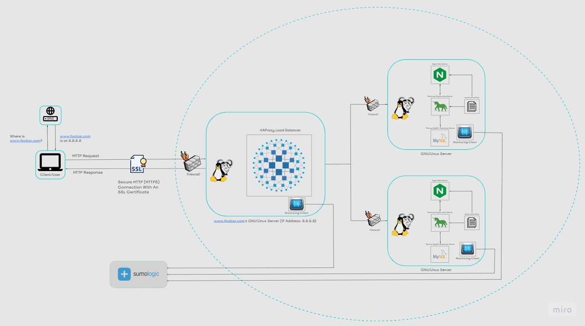

# Secured and Monitored Web Infrastructure

## Description

This web infrastructure comprises three servers, prioritizing security, monitoring, and encrypted traffic delivery.

## Specifics About This Infrastructure

Role of Firewalls: The firewalls act as a protective barrier for the network, safeguarding web servers from unauthorized access. Positioned between the internal and external networks, they block incoming traffic from undesired or unauthorized sources.
Function of SSL Certificates: SSL certificates encrypt traffic between web servers and the external network, thwarting potential man-in-the-middle attacks and network sniffing attempts. By ensuring privacy, integrity, and authentication, SSL certificates enhance security.
Role of Monitoring Clients: Monitoring clients oversee both servers and the external network, evaluating server performance and operations. They assess overall server health, promptly alerting administrators to deviations from expected performance. Monitoring tools furnish vital metrics on server operations, automatically testing accessibility, measuring response time, and flagging errors such as file corruption or security vulnerabilities.

## Issues With This Infrastructure

SSL Termination at Load Balancer: SSL termination at the load balancer level would leave traffic between the load balancer and web servers unencrypted, potentially compromising security.
Single MySQL Server Scalability: Relying on a single MySQL server poses scalability challenges and constitutes a single point of failure for the web infrastructure.
Uniform Server Components' Impact: Servers equipped with identical components may vie for resources like CPU, memory, and I/O, leading to performance degradation and complicating issue identification. Such a setup lacks scalability and flexibility.