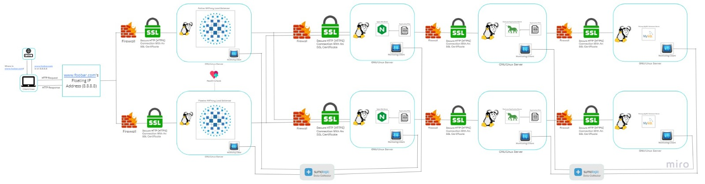

# Scaled Up Web Infrastructure

## Description
This expanded web infrastructure builds upon the architecture outlined [here](2-secured_and_monitored_web_infrastructure.md). All single points of failure (SPOFs) have been eliminated, and each key component—web server, application server, and database servers—now resides on distinct GNU/Linux servers. SSL protection is maintained across the network, with firewalls securing each server, all of which are under constant monitoring.

## Specifics About This Infrastructure

Individual Firewalls for Each Server: Each server is shielded by its own firewall, fortifying defense against unwanted or unauthorized access, enhancing overall security.

## Issues With This Infrastructure

Elevated Maintenance Costs: The transition to individual servers for each major component entails increased expenses in server acquisition and electricity consumption. This expansion necessitates additional server purchases, leading to a surge in the company's electricity bill. Allocating funds for server procurement and operational costs poses a financial strain on the company.
